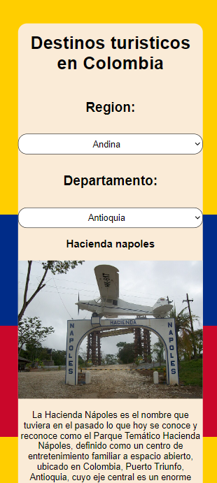
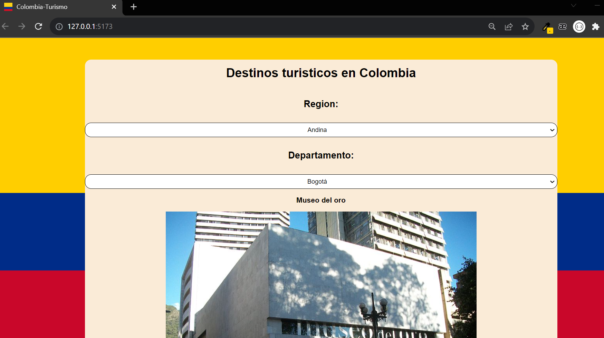

# Destinos turisticos en colombia

### Este repositorio fue construido con react.js

Contiene contenido dinamico de los principales lugares turiticos de colombia, filtrado por regiones y departamentos.

---

### Contiene:

- Componentes de react
- Reutilizacion de componentes
- Consumo de api
- Asincronismo
- Hooks
  - Personalizado
  - UseState
  - UseEffect

---

### [**_ver aplicacion_**](https://jorgejuancho.github.io/destinos-turisticos-colombia-react/)

